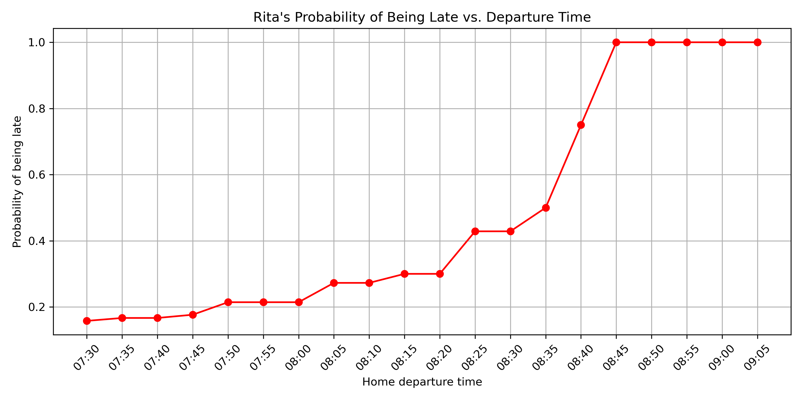

# RMK_internship_2025

Kaur Kullamäe

## Overview

This project analyzes public transport GTFS data, to evaluate commute reliability from a starting point, in this case is busstop "Zoo" and to a destination "Toompark".
The overall idea was to gather data from previous days, to get the median duration, which the bus takes from A to B.
When the median time estimate is known, aadditional other calculations can be done and probability calculated, to know whether Rita will be late or not.

---

## Implemented steps

### Data gathering

- The instructions suggested that live GPS data could be useful.
- I found a page that updates the previous day's GTFS data daily.
- To improve accuracy, I decided to gather more than just one day's data to better estimate the average bus duration between **7:30 – 9:00**.
- I created a script to download and unzip GTFS data from [peatus.ee](https://peatus.ee/gtfs/).
- Data gathering is automated via a cron job running on a server.

### GTFS Data Filtering

- Extracted **trip IDs** for a specific bus route: "Väike-Õismäe - Aigrumäe", in otherwords bus line 8
- Extracted **stop IDs** for departure stop "Zoo" and destination stop "Toompark"

### Travel Time Computation

- The main logic for travel time computation was: 
    - Match trips that go from Zoo to Toompark in the correct order
    - Calculate travel durations using "departure_time" and "arrival_time" fields from **stop_times.txt**
    - Only include trips that depart within a specified time window, because trips that go for example in lunch, don't matter to us
    - Convert GTFS times to seconds
  

### Approach

- Static walking times:
  - 300 seconds: Home → Departure bus stop
  - 240 seconds: Destination bus stop → Meeting
- Variable bus commute times:
  - Calculated from GTFS trip data
  - Primary method: Calculate mean trip duration for each route

## Results

- Using the gathered data, I generated a plot that shows the probability of being late to a meeting based on departure time.
- On average, the median commute time with bus is 12 minutes, taken from multiple days of data.
- The latest she could leave from home is: 8:44

## Data Sources

* GTFS data: [Peatus.ee GTFS feed](https://peatus.ee/gtfs/)
* Documentation about the GTFS data: [Public transport register specification](https://www.agri.ee/sites/default/files/documents/2023-07/%C3%BChistranspordiregister-avaandmed-spetsifikatsioon-v1_4.pdf) (v1.4)